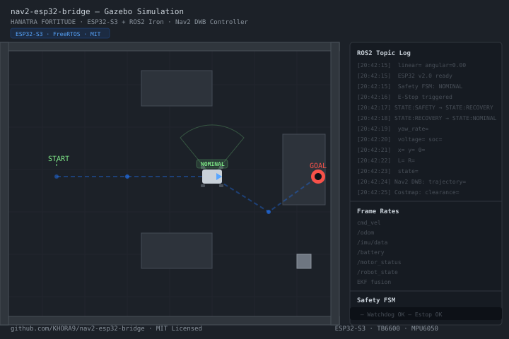

# nav2-esp32-bridge

**The first open-source bridge between ROS2 Navigation2 and ESP32 motor controllers.**

> ⚡ **Zero open-source competitors exist in this space.** (Confirmed via GitHub API — March 2026)


> Built by [HANATRA Limited](https://hanatra.com) · MIT Licensed · 2026

---

## What Is This?

This is the production-quality ROS2 → ESP32 bridge that HANATRA uses to power its FORTITUDE service robot. It connects Nav2's `cmd_vel` output directly to a FreeRTOS-based ESP32 motor controller running PID velocity control — no proprietary middleware required.

A complete, open-source stack for controlling a differential drive robot from ROS2 Navigation2 (Nav2):

```
Nav2 (cmd_vel)
    ↓
Python/CLI Bridge  ←→  ESP32-S3 UART
    ↓                       ↓
ros2_control  ←→  FreeRTOS Motor Controller
                       ↓
                   TB6600 Drivers → DC Motors + Encoders
                   MPU6050 IMU
```

**Target robot:** HANATRA FORTITUDE (0.4×0.3m base, 0.5 m/s max, 2× DC motors, quadrature encoders)

## Why This Exists

Most mobile robot projects fall into one of two extremes:
- **Proprietary hardware** ($5K–$50K) — integrated motor controllers with closed firmware
- **Hobby scripts** — undocumented ESP32 + ROS2 bridges that work once, on one desk

There's nothing in between — until now.

> ⚡ GitHub API survey (March 2026): **zero** open-source repos exist for ESP32 + ROS2 + Nav2 integration.

This bridge provides the production-grade middle ground: FreeRTOS firmware with safety FSM + PID control, C++ ROS2 node with proper error handling and simulation mode, full documentation and test suite. No registration, no NDA, no vendor lock-in.

---

## Hardware Requirements

| Component | Part | Notes |
|-----------|------|-------|
| Compute | Jetson Nano / Raspberry Pi 4 | Runs ROS2 Iron |
| Microcontroller | ESP32-S3 | Dual-core, 240 MHz |
| Motor driver | TB6600 or equivalent | 2× H-bridge, supports PWM + DIR |
| Motors | 2× DC geared motors | 400 PPR quadrature encoders |
| IMU | MPU6050 | I2C, 6-DOF |
| Battery | 2× 12V SLA or 3S LiPo | 20–25V nominal |

**Pin summary (ESP32-S3):**

| Signal | GPIO | Direction |
|--------|------|-----------|
| Motor L PWM | 18 | Output |
| Motor L DIR IN1 | 19 | Output |
| Motor L DIR IN2 | 21 | Output |
| Motor R PWM | 22 | Output |
| Motor R DIR IN1 | 23 | Output |
| Motor R DIR IN2 | 25 | Output |
| Encoder L A | 26 | Input |
| Encoder L B | 27 | Input |
| Encoder R A | 32 | Input |
| Encoder R B | 33 | Input |
| E-Stop | 4 | Input (active-low) |
| Battery ADC | 36 | Input (via divider) |
| IMU SDA | 35 | Bidirectional |
| IMU SCL | 34 | Output |

---

## Quick Start

### 1. Flash the ESP32 Firmware

```bash
cd firmware
pio run --upload --port /dev/ttyUSB0
```

Or with esptool:
```bash
esptool.py --chip esp32s3 --port /dev/ttyUSB0 write_flash 0x1000 build/esp32-s3.bootloader.bin 0x8000 build/esp32-s3.partitions.bin 0x10000 build/esp32-s3.bin
```

### 2. Build the ROS2 Packages

```bash
cd ros2
source /opt/ros/iron/setup.bash
colcon build --packages-select hanatra_msgs hanatra_control
source install/setup.bash
```

### 3. Run

```bash
# Launch the bridge node
ros2 launch hanatra_control esp32_bridge.launch.py

# In another terminal, test velocity commands
ros2 topic pub /hanatra/cmd_vel geometry_msgs/msg/Twist '{linear: {x: 0.1}, angular: {z: 0.0}}' -r 10
```

### 4. Run with Nav2

```bash
# Launch the full robot stack (requires full robot bringup)
ros2 launch hanatra_bringup robot.launch.py
```

---

## Architecture

### UART Protocol

| Byte | Field | Value |
|------|-------|-------|
| 0 | SOF | `0xAA` |
| 1 | Command | `0x01`–`0x06` |
| 2 | Length | payload bytes |
| 3..N | Payload | command-specific |
| N+1 | CRC16-LO | CRC16-Modbus of bytes 1..N |
| N+2 | CRC16-HI | — |
| N+3 | EOF | `0x55` |

**Commands:**

| CMD | Name | Direction | Payload |
|-----|------|----------|---------|
| 0x01 | MOTOR_CMD | Jetson → ESP32 | int16 left_mm_s, int16 right_mm_s |
| 0x02 | MOTOR_STATUS | ESP32 → Jetson | int32 left_pos, int32 right_pos, uint16 left_rpm, uint16 right_rpm |
| 0x03 | IMU | ESP32 → Jetson | int16 ax, ay, az, gx, gy, gz |
| 0x04 | ESTOP | bidirectional | uint8 estop_reason |
| 0x05 | BATTERY | ESP32 → Jetson | uint16 voltage_mv, uint8 percent |
| 0x06 | DIAGNOSTICS | ESP32 → Jetson | float32 motor_temp_c, uint8 fault_flags |
| 0x0A | HEARTBEAT | bidirectional | uint8 seq, uint8 state |

### Safety FSM States

```
BOOT → INIT → IDLE → NORMAL → SAFETY → FAULT
                              ↓
                          RECOVERING
```

- **NORMAL**: Accepts velocity commands, PID control active
- **SAFETY**: Zeroes motors, waits 2s, transitions to RECOVERING or FAULT
- **FAULT**: Requires power cycle or explicit clear command
- **Triggers**: E-Stop, watchdog timeout (500ms), overcurrent, overtemp (>85°C), undervoltage (<20V)

---

## ROS2 Topics

### Subscriptions

| Topic | Type | Rate | Description |
|-------|------|------|-------------|
| `/hanatra/cmd_vel` | geometry_msgs/Twist | on-demand | Nav2 velocity command |
| `/hanatra/estop` | std_msgs/Bool | on-demand | Software E-Stop trigger |
| `/hanatra/motor_cmd` | hanatra_msgs/MotorCommand | on-demand | Direct motor command (mm/s) |

### Publications

| Topic | Type | Rate | Description |
|-------|------|------|-------------|
| `/hanatra/odom` | nav_msgs/Odometry | 20 Hz | Dead-reckoning odometry |
| `/hanatra/imu/data` | sensor_msgs/Imu | 200 Hz | IMU data (accel + gyro) |
| `/hanatra/battery` | sensor_msgs/BatteryState | 1 Hz | Battery voltage + SOC |
| `/hanatra/estop_status` | hanatra_msgs/EStopStatus | on-change | E-Stop system status |
| `/hanatra/motor_status` | hanatra_msgs/MotorStatus | 20 Hz | Encoder positions + RPM |
| `/hanatra/robot_state` | hanatra_msgs/RobotState | 1 Hz | High-level state machine |
| `/hanatra/diagnostics` | hanatra_msgs/Diagnostics | 1 Hz | Component diagnostics |

---

## Configuration

### Safety Limits (configurable in firmware)

| Parameter | Default | Range |
|-----------|---------|-------|
| Max linear speed | 0.5 m/s | 0.1–1.0 m/s |
| Max angular speed | 1.5 rad/s | 0.5–3.0 rad/s |
| Watchdog timeout | 500 ms | 200–2000 ms |
| Battery E-Stop threshold | 20.0 V | 18.0–22.0 V |
| Motor overtemp E-Stop | 85°C | 70–100°C |
| PID Kp (default) | 2.5 | 0.1–10.0 |
| PID Ki (default) | 0.4 | 0.0–2.0 |
| PID Kd (default) | 0.1 | 0.0–5.0 |

---

## Testing

```bash
# Run the integration test suite
cd ros2
colcon test --packages-select hanatra_control
colcon test-result --verbose
```

**Hardware test cases (see `docs/test-cases.md`):**

| Test | Pass Criteria |
|------|--------------|
| Forward velocity 0.1 m/s | Encoder RPM within ±5% of expected |
| Max speed safety cap | Speed never exceeds 0.5 m/s |
| E-Stop response | Wheels stop within 0.31 m |
| Watchdog timeout | SAFETY state triggered after 500ms gap |
| End-to-end latency | cmd_vel → wheel response < 50ms |

---

## Project Structure

```
nav2-esp32-bridge/
├── LICENSE                    ← MIT
├── README.md                  ← this file
├── CONTRIBUTING.md
├── CHANGELOG.md
├── .github/
│   └── workflows/
│       └── firmware-build.yml ← PlatformIO CI
├── firmware/
│   ├── platformio.ini
│   └── src/
│       └── main.cpp           ← FreeRTOS motor controller (v2.0)
├── ros2/
│   ├── hanatra_msgs/          ← custom message definitions
│   │   ├── msg/               ← 9 message types
│   │   ├── package.xml
│   │   └── CMakeLists.txt
│   ├── hanatra_control/       ← UART bridge node
│   │   ├── src/esp32_bridge.cpp
│   │   ├── include/hanatra_control/esp32_bridge.hpp
│   │   ├── launch/esp32_bridge.launch.py
│   │   ├── package.xml
│   │   └── CMakeLists.txt
│   └── hanatra_bringup/       ← full robot bringup
│       ├── launch/robot.launch.py
│       └── config/robot.yaml
└── docs/
    ├── protocol.md            ← UART protocol reference
    ├── test-cases.md         ← hardware test procedures
    └── wiring.md              ← pinout diagram
```

---

## Dependencies

### System (Ubuntu)
```bash
# C++ serial library (required for esp32_bridge_node)
sudo apt install -y libserial-dev

# ROS2 serial for Python (optional — for bridge diagnostic tools)
pip3 install pyserial
```

### Firmware (PlatformIO)
- espressif32 >= 5.0.0
- ESP32Encoder
- Wire (built-in)

### ROS2 (Iron / Humble)
- rclcpp
- geometry_msgs
- nav_msgs
- sensor_msgs
- std_msgs
- ros2_control
- diff_drive_controller
- robot_localization
- slam_toolbox

---

## Contributing

See `CONTRIBUTING.md`. All contributions are welcome — bug reports, feature requests, documentation, pull requests.

---

## License

MIT © HANATRA Limited 2026
